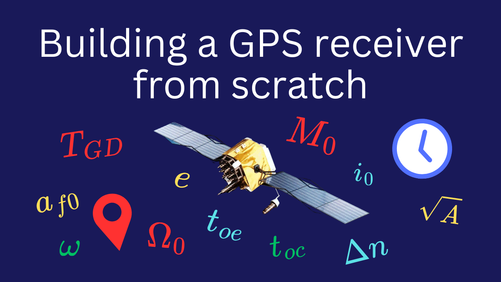

This repository contains my software-defined GPS receiver project.

<p align="center">
  
</p>

I also made a video series about the process that you can watch [on YouTube](https://www.youtube.com/playlist?list=PLmlXFuUXRl5BnKM9PM_tT9uIzlwUxGzLb).

<p align="center">
  <a href="https://www.youtube.com/playlist?list=PLmlXFuUXRl5BnKM9PM_tT9uIzlwUxGzLb">
    
  </a>
</p>

# Features

- Uses the legacy coarse/acquisition (C/A) code to produce clock bias and location estimates.
- Produces estimates in as little as ~24 s from cold start (depending on environmental factors).
- Location estimates tend to be within a few hundred metres of the true location.
- Runs from pre-recorded sample files or a connected RTL-SDR.
- Has an accompanying web-based dashboard to show location estimates and satellite information.
- Written in Python with no runtime dependencies other than aiohttp (for the dashboard), NumPy, Pydantic (for data serialisation), and pyrtlsdr.

# Receiver

The `gpsreceiver` directory contains a Python package that processes samples of GPS signals from a file or SDR dongle to estimate a clock bias and location. It logs information to `stdout`, e.g. when satellites are acquired or a solution is computed, but doesn't provide a graphical interface — for that you'll need to run the dashboard (see below).

> [!NOTE]
> All commands in this section should be run from the `gpsreceiver` directory.

## Setup

### Hardware

If you'd like to record your own samples or run the receiver in real-time from an [RTL-SDR](https://www.rtl-sdr.com/about-rtl-sdr/), you'll need [a GPS antenna](https://www.sparkfun.com/products/14986) and (optionally) [a ground plate](https://www.sparkfun.com/products/17519). You'll get the best results in large, open areas with a clear view of the sky in all directions, e.g. a park.

### Software

```bash
python -m venv .env
source .env/bin/activate
pip install -r requirements.txt
```

## Running

### From a file

The file must contain a series of I/Q samples recorded at a rate matching `SAMPLES_PER_MILLISECOND` in `config.py` (the default rate is 2.046 MHz). The samples' I and Q components must be represented by 32-bit floats and be interleaved, i.e.

```
[32-bit float][32-bit float][32-bit float][32-bit float]...
      ^             ^             ^             ^
  Sample 0 I    Sample 0 Q    Sample 1 I    Sample 1 Q
```

You can pass the file to the GPS receiver by running the following from within the `gpsreceiver` directory

```bash
python -m gpsreceiver -f $FILE_PATH -t $START_TIMESTAMP
```

where `$FILE_PATH` is the path to the file and `$START_TIMESTAMP` is the Unix time when the samples began being recorded.

Phillip Tennen made such a file available as part of his [Gypsum](https://github.com/codyd51/gypsum) project. It contains ~13 minutes of samples recorded from [St Ives in the UK](https://maps.app.goo.gl/jbhZ1QGLcfHn7PJA9). To use it:

1. Download `nov_3_time_18_48_st_ives.zip` from [here](https://github.com/codyd51/gypsum/releases/tag/1.0)
2. Unzip it.
3. Run `python -m gpsreceiver -f nov_3_time_18_48_st_ives -t 1699037280`.

If you'd like to record your own file:

1. Connect your antenna to your RTL-SDR and your RTL-SDR to your computer.
2. Install [GNU Radio](https://www.gnuradio.org/).
3. Open the GNU Radio Companion (GNURC) by running `gnuradio-companion`.
4. Open `rtl_srd_gps_sampler.grc` in GNURC.
5. Click play in GNURC. A window will open.
6. Record data for as long as you'd like.
7. Close the window that opened in step 5.
8. There will be a new file called `samples-TIMESTAMP`.
9. Run `python -m gpsreceiver -f samples-TIMESTAMP -t TIMESTAMP`.

### From an RTL-SDR

```bash
python -m gpsreceiver --rtl-sdr
```

## Development

```bash
# Autoformat
make format

# Type check
make type_check
```

# Dashboard

The dashboard takes information from the receiver's HTTP server and renders it in a web-based interface.

> [!NOTE]
> All commands in this section should be run from the `dashboard` directory unless otherwise noted.

> [!NOTE]
> The receiver only exposes an HTTP server when running from a file.
>
> Doing so when running from real-time RTL-SDR data causes the receiver to miss data and lose lock on satellites.

## Setup

```bash
pnpm install

# A Google Maps API key is required to show location estimates on a map. Replace
# the ellipses (...) with your API key. See here[1] for more instructions.
#
# 1: https://developers.google.com/maps/documentation/javascript/cloud-setup
echo "VITE_GOOGLE_MAPS_API_KEY=..." >> .env.local

# If you know the receiver's actual location and want to show it on the map to
# compare it with the estimated location, set this environment variable. Replace
# LAT and LNG with the receiver's actual latitude and longitude.
echo "VITE_ACTUAL_LOCATION=LAT,LNG" >> .env.local
```

## Running

```bash
pnpm start
```

Note that the GPS receiver must be running in order for data to be available to the dashboard.

## Development

```bash
# Autoformat
pnpm format

# Generate dashboard/src/http_types.ts from gpsreceiver/gpsreceiver/http_types.py.
#
# Run from the root of the repository.
./bin/generate_dashboard_types.sh

# Lint
pnpm lint

# Type check
pnpm type_check
```